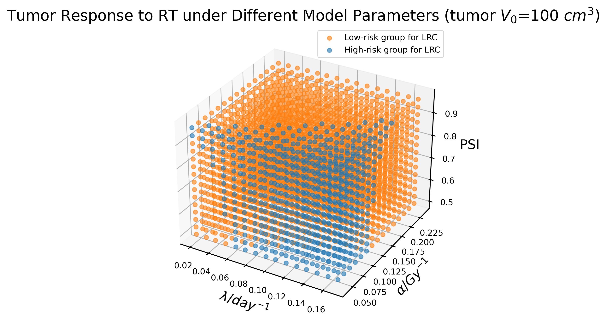
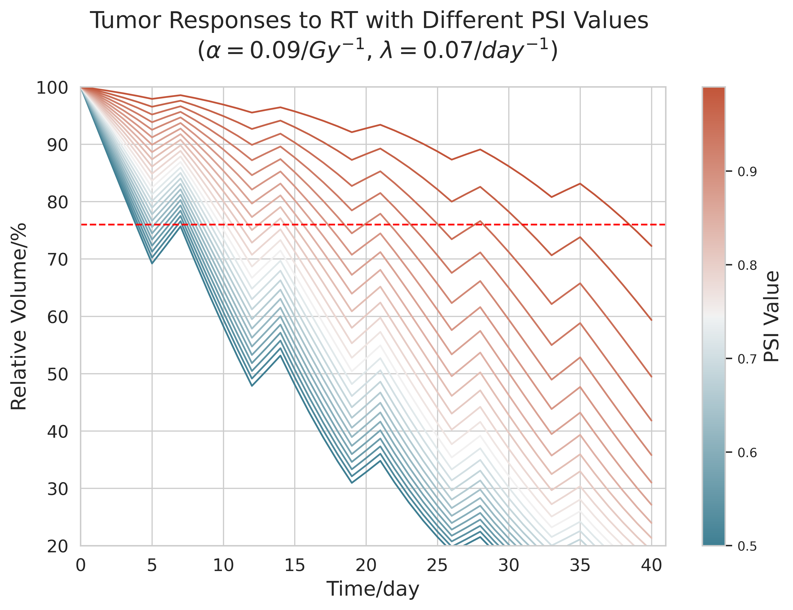
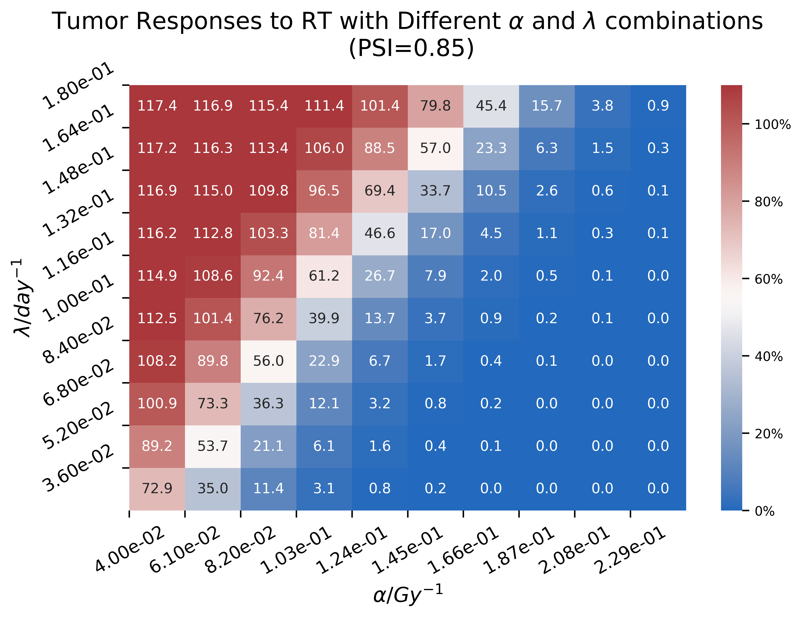

<style>
img{
    width: 60%;
    padding-left: 20%;
}
</style>

# Dose Fractionation Scheme Optimization for HNSCCs De-escalation Radiotherapy

## Overview

This repository contains code for optimizing fractionation scheme in radiotherapy(RT), particularly in the context of for HNSCCs De-escalation RT. 
This study aims to optimize the
daily dose fraction based on individual responses to RT, minimizing toxicity while maintaining a low risk of  locoregional control(LRC) failure.

## Installation

To use this code, clone the repository to your local machine:

```bash
git clone https://github.com/Yueyuhou/FractionOpt.git
cd FractionOpt
```
Make sure to have "Gymnasium" and "Tianshou" installed, along with the required packages.


## Usage

**Configuration**:

To use the optimization code, please configure tumor and model parameters first.

For model training and validation, set up  tumor and other relevant parameters in a configuration file. An example configuration file, named config_env_HN.yml, is provided in the repository.

For testing specific patients, set up the configuration file and write patients' parameters into an Excel file, including $\alpha$, $\lambda$, PSI and initial tumor volume.

1. **Model training and validation**
 ```bash
   python ppo_env.py ----path "your_configuration_path" --vol_threshold '73' --log_name "your_log_name"
   ```

2. **Optimize Dose Fractionation with the specified tumor and PSI model parameters**:

Note: Set training_config['resume'] = True in configuration file before running the code.

   ```bash
   python ppo_test_not_in_batch --data_path "excel_path"
   ```

   This will output an optimized dose fractionation plan based on the provided parameters.

3. **Visualization**
   
The code for analysing the impact of model parameters on prognosis and tumor shrinkage under conventional RT can be found in
Plot/plot_response_base_class.py.





Treatment schedules and tumor volume dynamics in personalized de-escalation RT can be visualized by Plot/plot_response_1stART.py.


